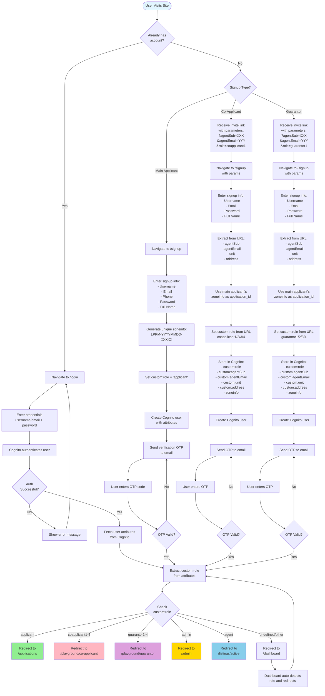
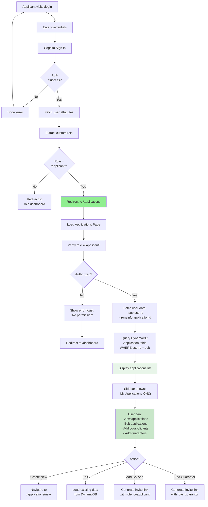
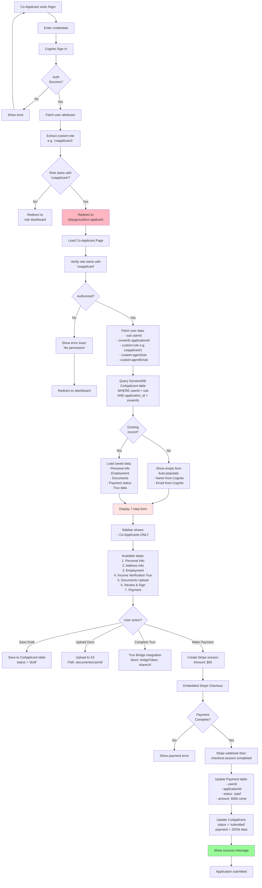
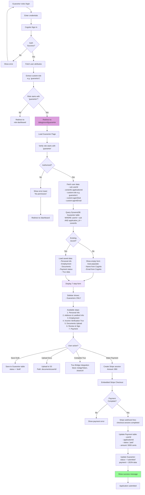
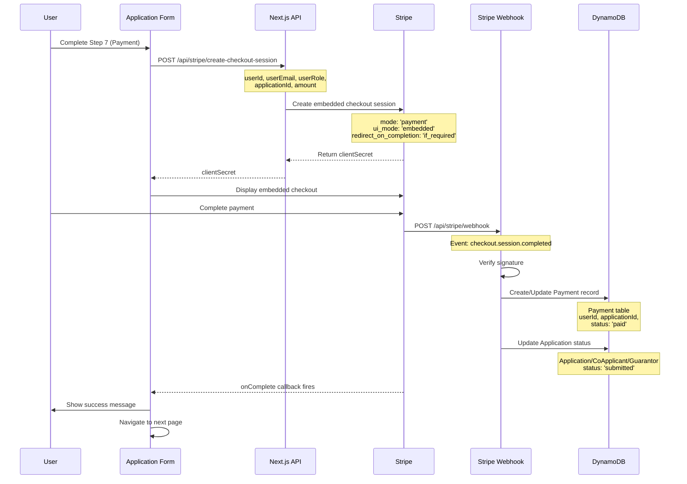

# 🔐 Login Flow Diagram - All User Types
 
## Overview
This document provides comprehensive logic flow diagrams for all three user types: Applicant, Co-applicant, and Guarantor.
 
---
 
## 📊 User Authentication & Role Assignment Flow
 

 
---
 
## 🎯 Applicant Login Flow
 

 
---
 
## 💑 Co-Applicant Login Flow
 

 
---
 
## 🛡️ Guarantor Login Flow
 

 
---
 
## 🔑 Key Cognito Attributes by User Type
 
### Applicant
```json
{
  "sub": "uuid-xxxx-xxxx",
  "email": "applicant@example.com",
  "email_verified": "true",
  "name": "John Doe",
  "phone_number": "+1234567890",
  "custom:role": "applicant",
  "zoneinfo": "LPPM-20260119-12345"
}
```
 
### Co-Applicant
```json
{
  "sub": "uuid-yyyy-yyyy",
  "email": "coapplicant@example.com",
  "email_verified": "true",
  "name": "Jane Smith",
  "phone_number": "+1234567891",
  "custom:role": "coapplicant1",
  "zoneinfo": "LPPM-20260119-12345",
  "custom:agentSub": "agent-sub-id",
  "custom:agentEmail": "agent@example.com",
  "custom:unit": "Apt 3B",
  "custom:address": "123 Main St"
}
```
 
### Guarantor
```json
{
  "sub": "uuid-zzzz-zzzz",
  "email": "guarantor@example.com",
  "email_verified": "true",
  "name": "Bob Johnson",
  "phone_number": "+1234567892",
  "custom:role": "guarantor1",
  "zoneinfo": "LPPM-20260119-12345",
  "custom:agentSub": "agent-sub-id",
  "custom:agentEmail": "agent@example.com",
  "custom:unit": "Apt 3B",
  "custom:address": "123 Main St"
}
```
 
---
 
## 🔐 Role-Based Access Control Matrix
 
| Feature | Applicant | Co-Applicant | Guarantor | Admin | Agent |
|---------|-----------|--------------|-----------|-------|-------|
| **Sidebar Access** |
| My Applications | ✅ | ❌ | ❌ | ✅ | ✅ |
| Co-Applicants | ❌ | ✅ | ❌ | ✅ | ❌ |
| Guarantors | ❌ | ❌ | ✅ | ✅ | ❌ |
| Admin Dashboard | ❌ | ❌ | ❌ | ✅ | ❌ |
| Active Listings | ❌ | ❌ | ❌ | ✅ | ✅ |
| **Page Access** |
| /applications | ✅ | ❌ | ❌ | ✅ | ✅ |
| /applications/new | ✅ | ❌ | ❌ | ✅ | ✅ |
| /playground/co-applicant | ❌ | ✅ | ❌ | ✅ | ❌ |
| /playground/guarantor | ❌ | ❌ | ✅ | ✅ | ❌ |
| /admin | ❌ | ❌ | ❌ | ✅ | ❌ |
| /listings/active | ❌ | ❌ | ❌ | ✅ | ✅ |
| **Actions** |
| Create Application | ✅ | ❌ | ❌ | ✅ | ✅ |
| Edit Application | ✅ | ❌ | ❌ | ✅ | ✅ |
| Submit Co-App Form | ❌ | ✅ | ❌ | ❌ | ❌ |
| Submit Guarantor Form | ❌ | ❌ | ✅ | ❌ | ❌ |
| Make Payment | ✅ | ✅ | ✅ | ❌ | ❌ |
| View All Applications | ❌ | ❌ | ❌ | ✅ | ✅ |
| Generate Invite Links | ✅ | ❌ | ❌ | ✅ | ✅ |
 
---
 
## 📊 Database Query Patterns by Role
 
### Applicant Queries
```typescript
// Get user's applications
const applications = await client.models.Application.list({
  filter: { userId: { eq: userSub } }
})
 
// Get co-applicants for application
const coApplicants = await client.models.CoApplicant.list({
  filter: { application_id: { eq: applicationId } }
})
 
// Get guarantors for application
const guarantors = await client.models.Guarantor.list({
  filter: { application_id: { eq: applicationId } }
})
```
 
### Co-Applicant Queries
```typescript
// Get own co-applicant record
const coApplicant = await client.models.CoApplicant.get({
  userId: userSub,
  coApplicantId: zoneinfo
})
 
// Or list all records for this user
const records = await client.models.CoApplicant.list({
  filter: {
    userId: { eq: userSub },
    application_id: { eq: zoneinfo }
  }
})
```
 
### Guarantor Queries
```typescript
// Get own guarantor record
const guarantor = await client.models.Guarantor.get({
  userId: userSub,
  guarantorId: zoneinfo
})
 
// Or list all records for this user
const records = await client.models.Guarantor.list({
  filter: {
    userId: { eq: userSub },
    application_id: { eq: zoneinfo }
  }
})
```
 
---
 
## 🔄 Payment Processing Flow (All User Types)
 

 
---
 
## 🎯 Key Implementation Files
 
### Authentication & Role Management
- `lib/cognito-sdk.ts` - Cognito SDK functions (signUp, signIn, attributes)
- `lib/role-routing.ts` - Role-based routing logic
- `components/login-form.tsx` - Login form component
- `components/signup-form.tsx` - Signup form component
 
### Page-Level Authorization
- `app/applications/page.tsx` - Applicant dashboard
- `app/playground/co-applicant/page.tsx` - Co-applicant dashboard
- `app/playground/guarantor/page.tsx` - Guarantor dashboard
- `app/admin/page.tsx` - Admin dashboard
 
### Forms & Payment
- `components/co-applicant-form.tsx` - 7-step co-applicant form
- `components/guarantor-form.tsx` - 7-step guarantor form
- `components/stripe-payment-step.tsx` - Embedded Stripe checkout
 
### API Routes
- `app/api/stripe/create-checkout-session/route.ts` - Create payment session
- `app/api/stripe/webhook/route.ts` - Handle Stripe events
 
### Database Operations
- `lib/co-applicant-db.ts` - Co-applicant CRUD operations
- `lib/guarantor-db.ts` - Guarantor CRUD operations
- `lib/payment-api.ts` - Payment status queries
 
---
 
## 🚀 Testing Scenarios
 
### Scenario 1: New Applicant
1. User visits site → No account
2. Click "Sign Up" → Role not specified
3. Enter details → Auto-assign role = 'applicant'
4. Verify email → Enter OTP
5. Login → Redirect to /applications
6. Create new application → 7-step form
 
### Scenario 2: Invited Co-Applicant
1. Applicant generates invite link with ?role=coapplicant1
2. Co-applicant receives link
3. Click link → Opens /signup with params
4. Sign up → Role = 'coapplicant1' auto-set
5. Verify email → Enter OTP
6. Login → Redirect to /playground/co-applicant
7. Fill form → Complete payment → Submit
 
### Scenario 3: Invited Guarantor
1. Applicant generates invite link with ?role=guarantor1
2. Guarantor receives link
3. Click link → Opens /signup with params
4. Sign up → Role = 'guarantor1' auto-set
5. Verify email → Enter OTP
6. Login → Redirect to /playground/guarantor
7. Fill form → Complete payment → Submit
 
### Scenario 4: Returning User
1. User has existing account
2. Visit /login
3. Enter credentials
4. Cognito validates
5. Fetch custom:role attribute
6. Redirect based on role:
   - applicant → /applications
   - coapplicant → /playground/co-applicant
   - guarantor → /playground/guarantor
   - admin → /admin
   - agent → /listings/active
 
---
 
## 🔐 Security Features
 
### Authentication
✅ Cognito JWT tokens for all authenticated requests  
✅ Email verification required (OTP)  
✅ Phone number validation (E.164 format)  
✅ Password complexity requirements  
 
### Authorization
✅ Role-based access control (RBAC)  
✅ Page-level authorization checks  
✅ Sidebar filtering based on role  
✅ API route protection  
 
### Data Isolation
✅ Users can only access their own data (userId filter)  
✅ Co-applicants scoped to application_id  
✅ Guarantors scoped to application_id  
✅ Admin has full access  
 
### Payment Security
✅ Stripe embedded checkout (PCI compliant)  
✅ Webhook signature verification  
✅ Metadata validation (userId, applicationId)  
✅ Amount stored in cents (5000 = $50.00)  
 
---
 
## 📈 State Management
 
### User State (All Roles)
```typescript
const [userId, setUserId] = useState<string>("")           // Cognito sub
const [userZoneinfo, setUserZoneinfo] = useState<string>("")  // Application ID
const [userRole, setUserRole] = useState<string>("")       // custom:role
const [email, setEmail] = useState<string>("")
const [name, setName] = useState<string>("")
```
 
### Application State (Applicant)
```typescript
const [applications, setApplications] = useState<Application[]>([])
const [coApplicants, setCoApplicants] = useState<CoApplicant[]>([])
const [guarantors, setGuarantors] = useState<Guarantor[]>([])
const [payments, setPayments] = useState<Payment[]>([])
```
 
### Form State (Co-Applicant/Guarantor)
```typescript
const [currentStep, setCurrentStep] = useState<number>(0)
const [formStatus, setFormStatus] = useState<"draft" | "submitted">("draft")
const [paymentStatus, setPaymentStatus] = useState<string>("pending")
const [documents, setDocuments] = useState<any[]>([])
const [truvBridgeToken, setTruvBridgeToken] = useState<string>("")
const [signature, setSignature] = useState<string>("")
```
 
---
 
## 🎉 Summary
 
This comprehensive flow diagram covers:
 
1. ✅ **Authentication** - Signup, login, OTP verification
2. ✅ **Role Assignment** - Automatic via custom:role attribute
3. ✅ **Authorization** - Page-level and component-level checks
4. ✅ **Routing** - Role-based dashboard redirection
5. ✅ **Data Access** - Scoped queries based on userId and role
6. ✅ **Payment Processing** - Stripe embedded checkout + webhooks
7. ✅ **Security** - JWT tokens, role validation, data isolation
 
All three user types (Applicant, Co-Applicant, Guarantor) follow similar patterns with role-specific variations in:
- Signup parameters (invite links with role)
- Dashboard access (different pages)
- Form workflows (similar 7-step structure)
- Data tables (different DynamoDB tables)
- Payment integration (same Stripe flow)
 
---
 
**Generated:** January 19, 2026  
**Version:** 1.0  
**Status:** ✅ Production Ready
 
 